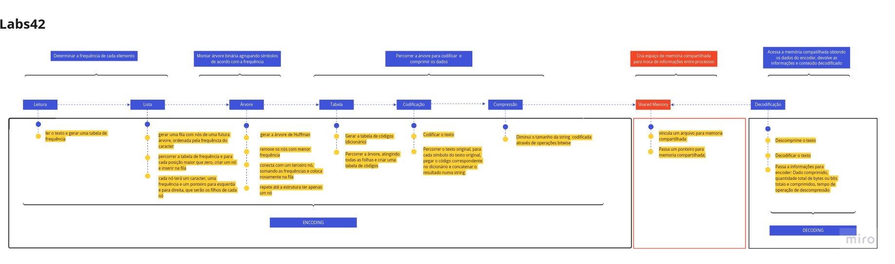

## Algoritmo de Huffman
Curso de Programação com a Linguagem C, desenvolvimento do código de Huffman (Algoritmo de Huffman).

Esse programa tem como objetivo criar de uma aplicação de análise e compressão de dados. Essa aplicação utilizará o algoritmo de compressão Huffman.

O Algoritmo de Huffman é um dos métodos de compressão mais utilizados e atua em diferentes tipos de arquivos, apesar de ter sido inicialmente desenvolvido para compressão de texto.

O criador é David Huffman, que desenvolveu o método em 1950 como parte da disciplina Teoria da Informação, em seu doutorado no MIT.

O algoritmo se baseia na na Teoria de Informação de Shannon (Shannon, 1948) e no princípio de que, num elemento de informação (texto, imagem, áudio, etc.) representado por símbolos, alguns desses símbolos ocorrem mais vezes que outros. 

Dessa forma, se representarmos esses símbolos mais comuns utilizando códigos menores (usando menos bits) e os símbolos menos frequentes usando códigos mais extensos (com menos bits), contrapondo à representação dos símbolos com códigos de comprimento fixo (como, por exemplo, ASCII), iremos obter uma codificação binária com menos bits, como resultado de uma diminuição do comprimento médio (em bits) de cada código.

Este algoritmo faz uso das seguintes estruturas:

- Tabela
- Lista encadeada ou fila
- Arvore binária

## Implementação do Algoritmo de Huffman neste projeto:
   

## Clonar o projeto
git clone https://github.com/42sp/42labs-selection-process-v4-alezamarion

## Compilacão
make
A compilação gerará dois executáveis: encoder e decoder

## Execução
Execute o encoder em um terminal: ./encoder
Execute o decoder em outro terminal: ./encoder

O encoder receberá o dado a ser comprimido e o decoder descomprimirá o dado. Os programas se comunicam utilizando *shared memory operations*.

https://www.tutorialspoint.com/inter_process_communication/inter_process_communication_shared_memory.htm

## Memória Compartilhada:

A comunicação entre processos com memória compartilhada é um conceito em que dois ou mais processos podem acessar uma memória comum.   
E a comunicação é feita por meio dessa memória compartilhada, onde as alterações feitas por um processo podem ser visualizadas por outro processo.

## Funções utilizadas para implementar a memória compartilhada:

- ftok(): É usado para gerar uma chave única;
- shmget(): Após a conclusão bem-sucedida, retorna um identificador para o segmento de memória compartilhada;
- shmat (): Antes de poder usar um segmento de memória compartilhada, você deve se anexar para ele usando esta função;
- shmdt(): Quando terminar o segmento de memória compartilhada, seu programa deve desvincule-se com esta função;
- shmctl(): Quando você desconecta da memória compartilhada, ela não é destruída. Então, é destruída com esta função;

